# 🌌 Platubot Admin — Panel de Control Central

¡Bienvenido al **Platubot Admin**! Este es el portal de administración central y consola de gestión premium para el ecosistema **Platubot**. Diseñado con una estética ciberpunk/futurista impactante basada en *glassmorphism* y efectos de neón, este panel web permite a los administradores autorizados interactuar con las colecciones de datos del bot, realizar copias de seguridad automáticas en GitHub y ejecutar operaciones CRUD en tiempo real con la máxima seguridad.

> [!NOTE]
> Este proyecto actúa como una interfaz administrativa y depende de la API del servidor principal de Platubot (ejecutándose en Bun) para procesar y almacenar físicamente la información.

---

## 🚀 Características Principales

*   🔒 **Acceso Seguro vía Discord OAuth2:** Sistema de autenticación de alta seguridad que restringe el acceso al panel. Solo los usuarios con el rol administrativo específico en el servidor oficial de Discord pueden iniciar sesión.
*   ⚡ **Dashboard CRUD en Tiempo Real:** Visualiza, filtra, edita, crea y elimina registros directamente sobre las colecciones del bot de forma instantánea.
*   📁 **Navegación Dinámica de Colecciones:** Un menú lateral reactivo autodetecta y lista todas las colecciones de datos disponibles en el bot.
*   📝 **Editor JSON Avanzado:** Interfaz que soporta campos planos y arrays u objetos anidados, incluyendo un validador de sintaxis JSON del lado del cliente antes de enviar cualquier cambio.
*   🛡️ **Doble Confirmación de Mutaciones:** Para prevenir cambios o eliminaciones accidentales en producción, las operaciones críticas requieren una doble validación: aceptar los riesgos en un checkbox de seguridad y escribir textualmente el nombre de la colección objetivo.
*   💾 **Integración Automática con Backups:** Cada cambio guardado o eliminado de forma segura notifica al bot para sincronizar el estado e iniciar un push automático a GitHub (`origin/main`), manteniendo un historial de cambios infalible.
*   🔮 **Interfaz Visual Premium:** Diseño de alto impacto que incluye fondos dinámicos con gradientes radiales pulsantes, tipografía moderna (`Outfit` y `JetBrains Mono`), componentes de carga fluidos e interacciones animadas.

---

## 🛠️ Stack Tecnológico y Arquitectura

El panel se ha estructurado con tecnologías modernas de desarrollo web, priorizando la velocidad, la seguridad y una excelente experiencia de desarrollo:

*   **Framework:** [Next.js v16.2.6](https://nextjs.org/) con la arquitectura **App Router** para un renderizado híbrido óptimo y enrutamiento simplificado.
*   **Biblioteca UI:** [React v19.2.4](https://react.dev/) para el manejo del estado del dashboard y la interactividad reactiva.
*   **Iconografía:** [Lucide React](https://lucide.dev/) para un conjunto de iconos modernos y consistentes.
*   **Estilos:** Vanilla CSS moderno con variables HSL globales, transiciones fluidas de aceleración bezier y estilos embebidos mediante `<style jsx>` para un control de componentes aislado y escalable.
*   **Encriptación:** Módulo nativo de Node.js `crypto` aplicando algoritmos simétricos `aes-256-cbc` y derivación de llaves mediante `scryptSync`.
*   **Gestor de Paquetes / Runtime:** Compatible con [Bun](https://bun.sh/) y [Node.js / npm](https://nodejs.org/).

---

## 📁 Estructura del Proyecto

A continuación se detalla la distribución de archivos y directorios clave del proyecto:

```bash
admin-web/
├── public/                 # Recursos estáticos públicos (imágenes, favicon)
├── src/
│   └── app/
│       ├── api/            # Rutas de API en el Servidor (Backend)
│       │   ├── auth/       # Módulo de Autenticación
│       │   │   ├── discord/
│       │   │   │   ├── login/      # GET: Redirecciona al usuario a Discord OAuth2
│       │   │   │   └── callback/   # GET: Intercambia código, valida rol, inicia sesión
│       │   │   └── logout/         # GET: Elimina la cookie de sesión y redirige a la Landing
│       │   └── database/
│       │       └── [[...path]]/    # API Route dinámica (Proxy para GET, POST, PUT, DELETE)
│       ├── components/     # Componentes reactivos del lado del cliente
│       │   └── Dashboard.js        # Core UI del Panel (Visualización de datos, CRUD, Búsqueda, Modales)
│       ├── utils/          # Utilidades auxiliares
│       │   └── session.js          # Helpers de Encriptación y Decodificación de sesiones (AES-256-CBC)
│       ├── favicon.ico     # Icono del sitio
│       ├── globals.css     # Estilos globales, variables HSL, fuentes y animaciones de fondo
│       ├── layout.js       # Layout raíz, inyecta texturas de fondo y metadatos SEO
│       └── page.js         # Página de entrada (Landing Page para login o render del Dashboard)
├── .env.example            # Plantilla de variables de entorno requeridas
├── eslint.config.mjs       # Configuración del linter ESLint
├── jsconfig.json           # Configuración de rutas relativas y JavaScript
├── next.config.mjs         # Configuración del compilador de Next.js
└── package.json            # Dependencias del proyecto y scripts
```

---

## ⚙️ Configuración y Variables de Entorno

Para ejecutar la aplicación localmente o en producción, debes crear un archivo `.env.local` en la raíz del proyecto. Toma como referencia el archivo `.env.example`:

```env
# CONFIGURACIÓN DE DISCORD OAUTH2 (Crear App en https://discord.com/developers/applications)
DISCORD_CLIENT_ID="TU_CLIENT_ID_DE_DISCORD"
DISCORD_CLIENT_SECRET="TU_CLIENT_SECRET_DE_DISCORD"
DISCORD_REDIRECT_URI="http://localhost:3000/api/auth/discord/callback"

# COMUNICACIÓN CON EL BOT (Servidor API de Bun)
BOT_API_URL="http://localhost:3001"
BOT_API_SECRET="platubot-super-secret-key-1234"

# VARIABLE DE SESIÓN (Texto aleatorio largo de 32+ caracteres)
SESSION_SECRET="generar-clave-segura-simetrica-de-32-caracteres"
```

### Obtención de Credenciales de Discord
1. Entra al [Discord Developer Portal](https://discord.com/developers/applications).
2. Crea una aplicación llamada **Platubot Admin** (o similar).
3. Ve a la sección **OAuth2**, copia el `Client ID` y genera un nuevo `Client Secret`.
4. En **Redirects**, añade exactamente la URL configurada en `DISCORD_REDIRECT_URI` (por ejemplo, `http://localhost:3000/api/auth/discord/callback` para desarrollo local).

---

## 🔑 Flujo de Autenticación y Seguridad

La seguridad es el pilar fundamental del panel. El flujo de autenticación opera de la siguiente manera:

```mermaid
sequenceDiagram
    autonumber
    actor Admin as Administrador
    participant Web as Web (Next.js Front)
    participant Server as Web Server (Next.js API)
    participant Discord as Discord API
    participant Bot as Bot API (Bun Server)

    Admin->>Web: Clic en "Ingresar con Discord"
    Web->>Server: Solicita inicio de sesión (/api/auth/discord/login)
    Server-->>Admin: Redirección a Discord OAuth2 Authorization URL
    Admin->>Discord: Aprueba permisos (Scope: identify)
    Discord-->>Server: Redirige al Callback con código de autorización (?code=xxx)
    
    rect rgb(20, 20, 30)
        note right of Server: Proceso del Callback (/api/auth/discord/callback)
        Server->>Discord: POST /api/oauth2/token (Intercambia código por Access Token)
        Discord-->>Server: Retorna Access Token
        Server->>Discord: GET /api/users/@me (Obtiene datos del usuario)
        Discord-->>Server: Retorna ID, Username, Avatar de Discord
    end

    rect rgb(30, 20, 20)
        note right of Server: Validación de Rol Administrativo
        Server->>Bot: POST /api/auth-check { userId: XXX } (Con token Bearer del Bot)
        Bot-->>Server: Retorna { authorized: true/false, user: { displayName } }
    end

    alt No Autorizado (Sin el rol en el Servidor Discord)
        Server-->>Admin: Redirección a Landing con ?error=unauthorized
    else Autorizado
        note right of Server: Creación de Sesión Segura
        Server->>Server: Genera JSON de sesión + Encripta con AES-256-CBC (SESSION_SECRET)
        Server-->>Admin: Redirige a "/" y establece Cookie "platubot_session" (HttpOnly, Secure, SameSite: Lax)
    end
```



### Detalles de Seguridad de la Sesión
*   **Cookie Encriptada:** La cookie `platubot_session` es totalmente ilegible para el navegador del cliente. Utiliza `HttpOnly` para evitar ataques XSS y `Secure` en producción para transmitirse únicamente a través de HTTPS.
*   **Algoritmo Simétrico:** El helper `encryptSession` realiza una derivación criptográfica de la contraseña (`SESSION_SECRET`) usando un "salt" estático para generar una clave simétrica de 32 bytes. Luego aplica un vector de inicialización (`IV`) único por sesión para blindar la encriptación.

---

## 📡 Proxy API de Base de Datos

Las operaciones a la base de datos no se realizan directamente desde el cliente hacia la base de datos ni hacia el bot. En su lugar, Next.js expone una ruta dinámica comodín (*catch-all*) que actúa como un **Proxy Reverso Seguro**:

*   **Ruta local:** `/api/database/[[...path]]/route.js`
*   **Funcionamiento:**
    1.  Cualquier petición a `/api/database/...` intercepta las cookies del navegador para extraer `platubot_session`.
    2.  Si la sesión no es válida o está ausente, retorna inmediatamente un error **401 Unauthorized**.
    3.  Si la sesión es válida, el servidor Next.js reconstruye la petición, le inyecta la cabecera `Authorization: Bearer <BOT_API_SECRET>` y la redirige al backend del bot en `BOT_API_URL`.
    4.  El proxy mapea las rutas automáticamente de la siguiente forma:

| Método HTTP | Ruta Frontend | Ruta Bot API Equivalente | Acción Realizada |
| :--- | :--- | :--- | :--- |
| **GET** | `/api/database` | `/api/collections` | Obtener la lista de nombres de colecciones. |
| **GET** | `/api/database/[col]` | `/api/collections/[col]` | Obtener todos los registros de una colección. |
| **POST** | `/api/database/[col]` | `/api/collections/[col]` | Crear un nuevo registro dentro de una colección. |
| **PUT** | `/api/database/[col]/[id]` | `/api/collections/[col]/[id]` | Actualizar un registro específico por su ID. |
| **DELETE**| `/api/database/[col]/[id]` | `/api/collections/[col]/[id]` | Eliminar un registro específico por su ID. |

---

## 🛡️ Doble Verificación de Seguridad

Debido a que el panel tiene permisos de escritura directa sobre la base de datos de producción de Platubot, y a que cada cambio desencadena un push inmediato al repositorio de GitHub para sincronización y backups, se ha diseñado un sistema de **doble confirmación visual obligatoria** en el frontend para evitar cualquier error humano.

Al intentar realizar un **Guardado**, **Edición** o **Eliminación**, el sistema desplegará un modal emergente bloqueante que requiere dos pasos de validación:

1.  **Checkbox de Aceptación de Riesgo:** El administrador debe marcar una casilla reconociendo que entiende las consecuencias de la operación y el backup automatizado en GitHub.
2.  **Verificación de Nombre de Colección:** Se le exige al administrador que escriba exactamente el nombre de la colección en la que está operando (por ejemplo, escribir `"users"` o `"configurations"`). El botón de ejecución permanecerá deshabilitado e inactivo hasta que el texto coincida exactamente y la casilla esté marcada.

---

## 💻 Guía de Desarrollo

### Requisitos Previos
Asegúrate de contar con alguno de los siguientes entornos instalados:
*   [Bun](https://bun.sh/) (Recomendado por su extrema velocidad y compatibilidad nativa con el bot).
*   [Node.js](https://nodejs.org/) (Versión 18 o superior) junto con `npm` o `yarn`.

### 1. Instalación de Dependencias
Ejecuta el comando correspondiente en la raíz del proyecto para descargar los módulos:

```bash
# Con Bun (Recomendado)
bun install

# Con npm
npm install
```

### 2. Ejecutar en Modo Desarrollo
Inicia el servidor local de desarrollo en [http://localhost:3000](http://localhost:3000):

```bash
# Con Bun
bun dev

# Con npm
npm run dev
```

### 3. Compilación de Producción
Para generar el bundle optimizado para despliegues de producción:

```bash
# Con Bun
bun run build

# Con npm
npm run build
```

### 4. Análisis de Código (Linter)
Valida que el código siga las mejores prácticas estilísticas y de calidad:

```bash
# Con Bun
bun run lint

# Con npm
npm run lint
```

---

> El equipo de desarrollo de **Platubot** se compromete a mantener la estabilidad y robustez del sistema. Ante cualquier duda o inconveniente en la configuración, por favor consulta el repositorio principal o contacta al administrador del sistema. 🌌
